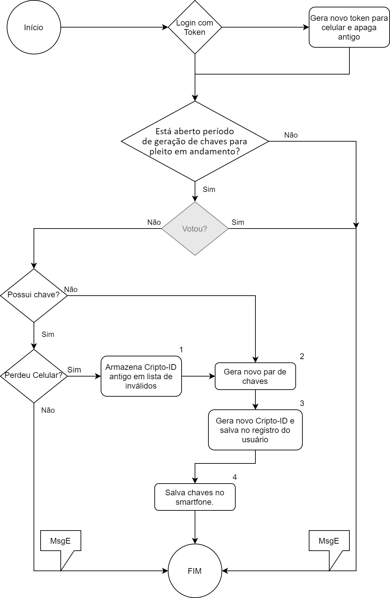

# Capítulo 2 – Par de Chaves

O par de chaves desempenha um papel muito importante neste protocolo, que é o de garantir a autenticidade do voto em todo o processo. É importante que a geração dos pares de chaves seja bastante controlada para evitar que a mesma pessoa possua mais de um par de chaves. Assim, deve ter sua geração controlada pelo órgão eleitoral. Preferivelmente, o órgão eleitoral deverá ele mesmo gerar as chaves e ser a autoridade certificadora ou pelo menos ancestral na cadeia do certificado. Vamos adotar para este protocolo chaves RSA de 2048 bits.

A geração do par de chaves pode ser feita através de um serviço provido pelo órgão eleitoral ou presencialmente em caso de algum problema e ficará armazenado somente no smartfone do eleitor. O serviço que gerar as chaves não deverá manter cópia das chaves tanto para ganrantir que ninguém mais possa as usar, quanto proteger o anonimato do voto. Para a geração será fornecido o número da identificação do eleitor juntamente com este órgão. Será mantida na base de dados do órgão apenas o regitro de que este eleitor já gerou sua chave e um número gerado com a chave privada, chamaremos este número de Cripto-ID. 

A Cripto-ID é terá a função de invalidar um par de chaves que tiver sido roubado ou perdido. Assim, caso um eleitor tenha perdido o smartfone e precise gerar novamente um par, será necessário que o par antigo seja invalidado. Para isto será criado um hash utilizando a chave privada com um número único aleatório. Se o usuário possuía um par de chaves e precisou gerar um novo, ao gerar o novo, o Cripto-ID antigo será adicionado à uma lista de números inválidos que impedirá que alguém use o par de chaves antigo para votar. E o número novo ficará armazemado no smartfone do usuário juntamente com o par de chaves. O Cripto-ID ficará armazenado no registro do eleitor até o momento da eleição. No momento da eleição os Cripto-ID's serão enviados aos servidores Block Chain em duas listas, uma lista de ID's inválidos e uma lista dos ID's válidos. Veja abaixo o ciclo de vida do Cripto-ID.

### Figura 3 – Ciclo de vida do Cripto-ID.

Os pares de chaves terão um prazo de validade de 1 ano. Assim, é recomendável que seja demarcada uma data limite antes da eleição até quando os usuários poderão gerar o seu par.

O serviço de geração de chaves deverá implementar o processo apresentado na figura 4. O processo apresentado é minimalista, mas pode ser feito de forma diferente desde que observe os passos que preservem os princípios discutidos anteriormente.

O processo se inicia realizando o login com o token gerado para permitir acesso ao smartfone. Caso não possua um token ou tenha perdido o dispositivo ou, ainda, tenha trocado, será gerado um novo token. Para a geração do token poderá ser utilizado um nome de usuário e senha junto ao órgão eleitoral e verificando dados do eleitor. Mais a frente trataremos melhor do token.

Uma vez logado, será verificado se o período para geração de chaves está sendo respeitado. Se não estiver no período, o fluxo será encerrado com uma mensagem de erro. Caso o período esteja aberto, será realizada a verificação se o usuário já votou. Isto é importante porque, caso seja possível ainda gerar pares de chave na data ou datas de votação, temos que garantir que o usuário não gerará novas chaves após ter votado.

Sendo permitido ao usuário continuar com o processo, será necessário consultar os registros do usuário para verificar se ele já possui um par de chaves para o pleito corrente. Caso não possua, prosseguirá para a geração. Caso já possua nos seus registros (o próprio aplicativo não permitirárealizar esse processo se já tiver um), será necessário armazenar o Cripto-ID antigo em uma lista (tabela na base de dados) de ID's inválidos.

O par de chaves será gerado utilizando o algoritmo RSA de 2048 bits sem adicionar qualquer dado do usuário ao certificado para que ele não possa ser identificado, mas deve possuir um número único com a finalidade de impedir que o certificado seja utilizado novamente para votar. Poderá ser utilizado um PIN para proteger as chaves contra uso indevido.

Após a geração do par é o momento de gerar-se o Cripto-ID, que já foi explicado anteriormente e que ficará salvo no registro do usuário até o dia ou data final da eleição.

E, finalmente, o par de chaves será baixado pelo aplicativo no smartfone do usuário e não ficará salvo no servidor. Para obter mais informações sobre o funcionamento do serviço de geração de chaves verifique o [Capítulo 6 - Os Três Serviços](#capítulo-6--os-três-serviços) no tópico sobre este serviço.

### Figura 4 – Fluxo do processo de geração de certificados.

