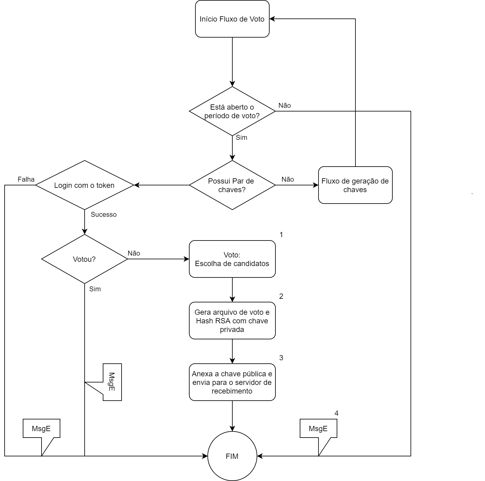

# Capítulo 5 – Votação

O processo de votação é o centro deste protocolo e envolve não apenas o voto e as chaves, mas todo um aparato de servidores, aplicativo e outros softwares para que torne possível se alcançar uma votação segura.

Este processo devera seguir o fluxo apresentado na figura 3, e se inicia pela verificação se está aberto o período de votação. Para isto, o aplicativo deverá enviar uma requisição para o servidor front, que enviará a resposta devolta para o aplicativo informando se o período está aberto. Se o período não estiver aberto, será apresentada a mensagem de erro para o usuário deixando-o saber que não poderá concluir a votação.

Após esta verificação, será realizada uma nova verificação apenas no aplicativo, que consiste de checar se foi gerado o par de chaves e se este está armazenado no dispositivo. Se não encontrar o par de chaves, deverá ser encaminhado para o processo de geração de chaves.

Encontradas as chaves, será o momento de realizar login com o token do usuário e a senha. Ao realizar este procedimento será gerado um token de curta duração, vinculado ao endereço de IP do usuário para prevenir que possa ser utilizado por outro dispositivo (ou seja, impedir que este token seja roubado), apenas para o processo do voto. O login será realizado no servidor front que consultará a base para verificar se o token enviado e a senha são válidos e retornará o token de curta duração.

Após o login, será verificado se o eleitor já votou ou não. Caso o eleitor já tenha votado, será finalizado o processo. Caso ainda não tenha votado será dada continuação ao processo. A verificação será feita na base de dados através do servidor front, consultando uma tabela que armazene o status do eleitor para o corrente pleito.

### Figura 5 – Fluxo do processo de votação.
